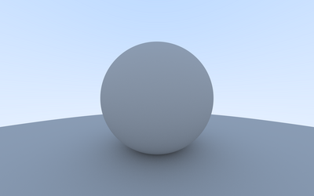
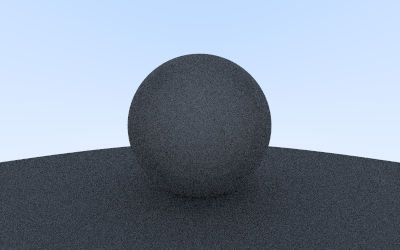
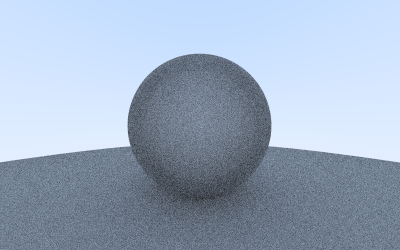
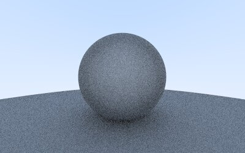
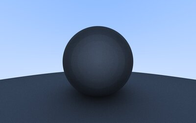
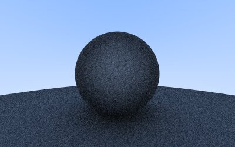
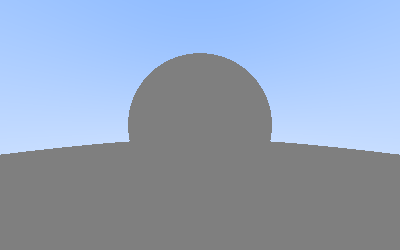
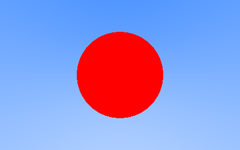
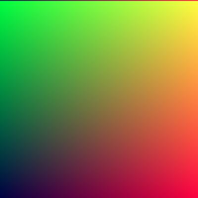

# Rust ray tracer

I'm learning [Rust](https://www.rust-lang.org/) and decided to tackle the classic [Ray Tracing in One Weekend](https://raytracing.github.io/) project by Peter Shirley.  All the algorithms and general code structure are from that book, just translated the examples from C++ into Rust.  I haven't written a ray tracer before, but I hope to reimplement it in a few other languages after Rust, like [Zig](https://ziglang.org/) and the language I know best, JavaScript, just for a performance comparison.

## Some renders

Here are some renders, some are to document subtle bugs, and some are just to celebrate first successful renders with new features!

